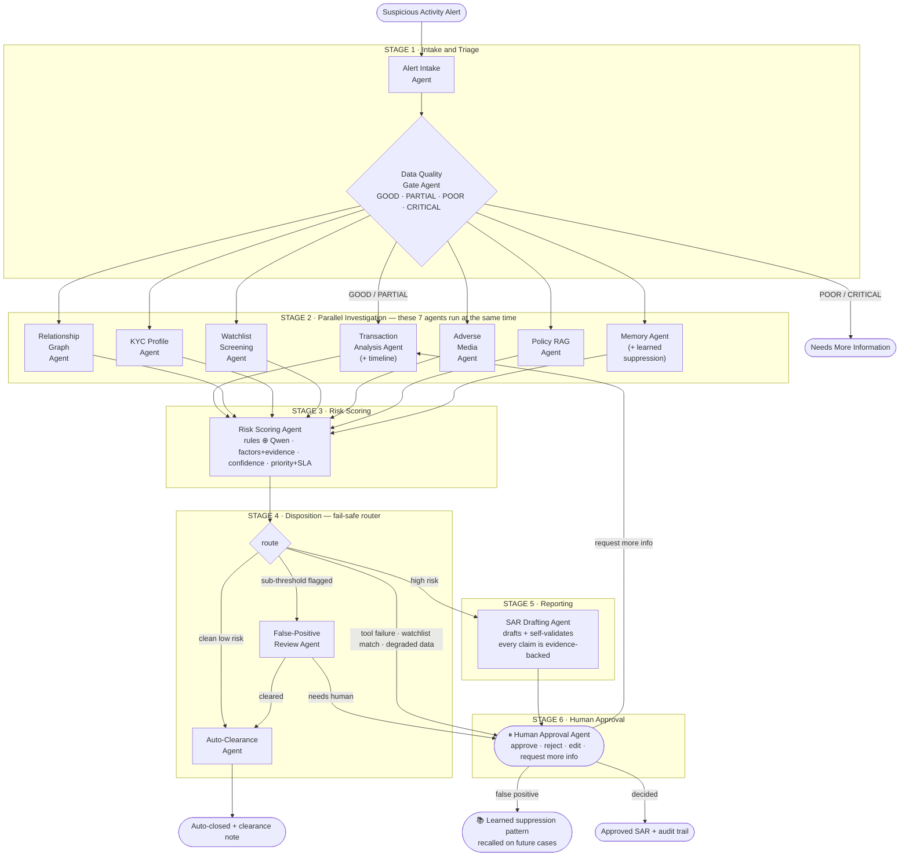

# ComplianceGuard

**A self-learning false-positive triage copilot for AML compliance teams.** It investigates each suspicious-activity alert end to end, **auto-clears the ones that are clearly benign with a full audit trail**, and escalates the genuinely risky ones with a drafted SAR — in about a minute, with a human in control of every filing.

The part that compounds: **it learns from your analysts.** The moment a reviewer clears a vendor as a false positive, the system remembers it and applies that judgement to *every other customer* — so the same benign payment never wastes an analyst's time twice. The backlog shrinks the more the team uses it.

Runs on a **local LLM** (Qwen via Ollama) — **customer data never leaves your environment**, which is what gets it past InfoSec and procurement. Built with **LangGraph** orchestration, **RAG with cross-encoder reranking** (ChromaDB), tool-calling into **Supabase**, relationship-graph network analysis, and a **FastAPI** backend with live streaming.

> Every decision is traceable to its evidence, the rules that fired, the policies cited, and the human who approved it — a glass box, not a black box.

📊 **[Pitch Deck / Presentation slides →](https://canva.link/wkpc0vxa01w1lkm)**

---

## The problem

**~95% of AML alerts are false positives.** A small compliance team at a fast-growing fintech gets buried in them: every alert means manually pulling transaction history, cross-referencing the KYC profile, screening watchlists and adverse media, checking internal policy, judging the risk, and documenting the outcome — over and over, for activity that turns out to be a legitimate vendor payment. It's slow, repetitive, inconsistent between reviewers, and it doesn't scale with transaction growth.

The kicker: teams re-review the **same benign vendors** again and again, because that knowledge lives in an analyst's head, not the system.

**ComplianceGuard automates the investigation, auto-clears the obvious false positives, and — uniquely — learns each team's clearance decisions so the backlog keeps shrinking.** It never files anything automatically; a human approves every escalation.

---

## Who it's for

Not Tier-1 banks with 200-analyst financial-crime units and a 18-month Quantexa rollout. **The underserved middle:**

- **Neobanks, payment processors, MSBs, and crypto exchanges** (Series A–C) with real AML obligations and rising alert volume — but **2–10 analysts** drowning in false positives.
- Teams that need value in **week one**, not after a year of professional services.
- Compliance and InfoSec leaders who can't send customer data to a third-party cloud model — **the local LLM means data never leaves their environment**.

See [GO-TO-MARKET.md](GO-TO-MARKET.md) for the target customer, ROI math, adoption roadmap, and differentiation. See [DEMO.md](DEMO.md) for the 3-act demo (including the self-learning moment). See the **[Pitch Deck](https://canva.link/wkpc0vxa01w1lkm)** for the full presentation.

---

## Architecture

A LangGraph pipeline runs a case through **6 stages**. Stage 2 runs **7 agents in parallel**; a **fail-safe router** in Stage 4 decides what happens next.

### The 6 stages at a glance

| Stage | What happens | Agents | Output |
|-------|--------------|--------|--------|
| **1 · Intake & Triage** | Classify the alert, assign priority, **grade data quality** | Alert Intake, Data Quality Gate | typed + prioritized alert — or **halt** if data is missing |
| **2 · Parallel Investigation** | 7 agents gather signals **simultaneously** | Transaction Analysis (+ annotated timeline), Relationship Graph, KYC, Watchlist, Adverse Media, Policy RAG, **Memory (+ cross-customer learned suppression)** | findings + structured **evidence** |
| **3 · Risk Scoring** | Deterministic rules **⊕** Qwen judgment | Risk Scoring | score, **factor breakdown**, calibrated confidence, **priority + SLA** |
| **4 · Disposition** | A **fail-safe router** picks the path | False-Positive Review, Auto-Clearance | auto-close · FP review · manual review · SAR |
| **5 · Reporting** | Draft a SAR + **self-validate** every claim is evidence-backed | SAR Drafting | 12-section **SAR package** |
| **6 · Human Approval** | An analyst makes the final call — **and their verdict feeds the learning loop** | Human Approval | **approved SAR + full audit trail** |

### Flow



## Agent pipeline — 14 agents across the 6 stages

| # | Agent | Stage | Responsibility |
|---|-------|-------|----------------|
| 1 | **Alert Intake** | 1 · Intake & Triage | Classifies alert type/severity, assigns a provisional **P1–P4** priority, extracts entities, routes |
| 2 | **Data Quality Gate** | 1 · Intake & Triage | Grades data **GOOD / PARTIAL / POOR / CRITICAL_MISSING** with a score; halts un-investigable cases, forces manual review on degraded data |
| 3 | **Transaction Analysis** | 2 · Investigation | Detects the ML **typology** (structuring, mule, layering, overseas, volume spike), computes the **account behaviour baseline**, and builds the **chronological, annotated timeline** with per-event risk notes |
| 4 | **Relationship Graph** | 2 · Investigation | Builds the **money-flow graph** — fan-out, rapid forwarding, common collector, circular flow (layering / mule network signatures) |
| 5 | **KYC Profile** | 2 · Investigation | **5 consistency checks** (income, occupation, account age, risk, history) + triggers **EDD** |
| 6 | **Watchlist Screening** | 2 · Investigation | Fuzzy-screens **both customer and recipient** against sanctions / PEP / blacklist / scam lists |
| 7 | **Adverse Media** | 2 · Investigation | Negative-news screening (fraud, investigations, enforcement) — catches entities before they're formally listed |
| 8 | **Policy RAG** | 2 · Investigation | Retrieves policies via **vector recall + cross-encoder rerank** over **heading-chunked** docs; returns scored, section-level **citations** |
| 9 | **Memory Agent** | 2 · Investigation | **Long-term memory** (prior cases/escalations, repeat recipients) **+ cross-customer learned suppression** — recalls vendors the team has cleared as false positives, on *any* customer, and cites the originating case |
| 10 | **Risk Scoring** | 3 · Scoring | Blends a **rule baseline** with an independent **Qwen assessment**; emits a **factor breakdown referencing evidence by ID**, a **calibrated confidence**, and a risk-aware **priority + SLA** |
| 11 | **False-Positive Review** | 4 · Disposition | Structured FP workflow — clears benign cases (known recipient, invoice, clear purpose, **learned suppression**) or refers sanctions name-matches to a human |
| 12 | **Auto-Clearance** | 4 · Disposition | Emits a professional **clearance note** (reason + evidence + recommended action) instead of silently ending |
| 13 | **SAR Drafting** | 5 · Reporting | Generates a structured **12-section regulator-style SAR package** (JSON → Markdown / PDF / DOCX) and **self-validates** every claim is evidence-backed before a human sees it |
| 14 | **Human Approval** | 6 · Approval | Structured decision: **approve / reject / edit / request_more_info**, SAR edits, risk overrides, and **feedback tags that train the cross-customer learning loop** |

> Every agent extends `BaseAgent` and emits an **evidence-backed audit rationale** (not raw chain-of-thought), a **confidence score**, **model-governance metadata** (model, prompt, ruleset, policy version), and an agent-to-agent (A2A) status message.

### Design principles

- **Self-learning, but glass-box** — analyst false-positive clearances become reusable, **cited** suppression patterns applied across all customers. The system gets better with use, and you can always trace *why* it suppressed an alert back to the human decision that taught it.
- **Hybrid, not pure-LLM** — deterministic rules/graph/screening compute facts and provide an auditable safety floor; the LLM reasons, judges, and explains. Most investigation agents use no LLM at all (recorded as `model_name: null`).
- **Traceable** — every risk factor references **evidence by ID**, and each `EvidenceItem` points to the exact source (a transaction, a profile field, a watchlist entry). One hop from any score back to the raw fact.
- **Fail-safe** — incomplete data → request more info; a failed tool, a watchlist match, or degraded data → manual review (never a SAR on bad data); a human always makes the final call.
- **Calibrated, not self-reported** — confidence is derived from objective signals (data quality, policy found, tool failures, evidence strength), not "the LLM says 87%".
- **Cost-aware** — math, name matching, and graph analysis are plain Python; the LLM is used only where reasoning adds value ($0 on a local model).

---

## Key features

- **🧠 Cross-customer self-learning triage** — the headline. When an analyst clears a vendor as a false positive, the system distils a **portable suppression pattern** and applies it to *every future customer*, citing the originating case. The false-positive backlog shrinks the more the team uses it. *(`learned_patterns` table, `case_memory` agent, `GET /learning`.)*
- **14-agent orchestration** (LangGraph) with **7 parallel** investigation agents and **fail-safe conditional routing**
- **Relationship-graph network analysis** — layering / money-mule detection (fan-out, forwarding chains, common collectors, circular flow) with a graph risk score
- **Account behaviour baseline** — scores deviation from the customer's *own* normal (amount spikes, new countries, off-hours, dormant-account reactivation)
- **Adverse-media screening** + multi-list **watchlist** screening (sanctions / PEP / blacklist)
- **Real RAG** — heading-aware chunking + cross-encoder reranking, with section-level **policy citations**; upload your own `.md`/`.pdf` policies and the system **auto-re-indexes**
- **Economic-purpose & source-of-funds** awareness (per SC guidance on clarifying unusual transactions)
- **Structured evidence layer** — every claim is a traceable `EvidenceItem`; risk factors reference evidence IDs
- **Calibrated confidence**, **risk-aware priority + SLA deadlines**, and a graded **data-quality severity**
- **Case status lifecycle** — an enforced state machine (`NEW → … → APPROVED_FOR_STR_REVIEW`) that rejects impossible transitions
- **False-positive workflow** + **auto-close clearance notes** (the system never silently closes a case)
- **Model governance** — every output records model / prompt / ruleset / policy version for reproducibility
- **Human-in-the-loop** — structured decisions, SAR edits, risk overrides, bounded re-investigation
- **Full audit trail in Supabase** — cases, evidence, rule hits, policy citations, status history, SAR drafts, decisions (survives restarts); `GET /case/{id}/trace` returns the whole chain
- **12-section regulator-style SAR** exported to **PDF / DOCX / Markdown**
- **Live progress streaming** (SSE) so the UI shows each agent completing in real time
- **Evaluation suite** — golden AML scenarios scoring typology / routing / retrieval / FP-clearance / SAR-completeness, plus **107 offline unit tests**

---

## Tech stack

| Layer | Technology |
|-------|-----------|
| Orchestration | LangGraph (StateGraph, parallel fan-out, `interrupt()` HITL, checkpointer) |
| LLM | Qwen 2.5 (local, via Ollama) — OpenAI-compatible API |
| Embeddings | nomic-embed-text (Ollama) |
| Vector DB / RAG | ChromaDB + `ms-marco-MiniLM` cross-encoder reranker |
| Relational DB / audit | Supabase (Postgres) |
| Watchlist / name matching | rapidfuzz |
| API | FastAPI + Uvicorn (REST + SSE streaming) |
| Document export | fpdf2 (PDF), python-docx (DOCX), PyMuPDF (policy PDF ingest) |
| Tests / evals | pytest + golden-case eval suite |

---

## Repository structure

```
backend/
├── main.py                 # CLI runner
├── server.py               # FastAPI server entry point
├── schema.sql              # Supabase source tables + seed data
├── schema_cases.sql        # Supabase audit/persistence tables
├── requirements.txt
├── tests/                  # 109 offline unit tests (LLM + DB mocked)
├── evals/                  # golden-case evaluation suite (rules / RAG / SAR quality)
└── app/
    ├── orchestrator.py     # wires the 14 agents into the LangGraph
    ├── api/routes.py       # FastAPI endpoints (REST + SSE + export + /learning)
    ├── core/
    │   ├── config.py       # loads .env, all settings
    │   ├── state.py        # the shared CaseState
    │   ├── evidence.py     # structured EvidenceItem + traceability
    │   ├── baseline.py     # account behaviour baseline + deviations
    │   ├── timeline.py     # annotated transaction timeline (folded into analysis)
    │   ├── priority.py     # risk-aware priority + SLA
    │   ├── confidence.py   # confidence calibration
    │   ├── case_status.py  # case lifecycle state machine
    │   └── governance.py   # model-governance metadata
    ├── rules/              # AML rule engine (yaml-driven) + country-risk register
    ├── agents/             # one file per agent + base.py (BaseAgent)
    ├── services/           # llm.py (Qwen), persistence.py (+ learned patterns), sar_render.py
    ├── tools/
    │   ├── db.py           # Supabase queries
    │   ├── rag.py          # ChromaDB + chunking + reranking + citations
    │   ├── adverse_media.py# negative-news screening
    │   ├── graph_analysis.py # money-flow network analysis
    │   └── policies/       # policy documents (.md / .pdf) indexed by RAG
    └── data/scenarios.py   # demo alerts
```

---

## Setup

### Prerequisites
- **Python 3.11+**
- **Ollama** ([ollama.com](https://ollama.com)) — runs the local LLM
- A **Supabase** project (free tier) — the relational database + audit store

### 1. Clone + create a virtual environment
```bash
git clone https://github.com/sonnysanputra/ComplianceGuard.git
cd ComplianceGuard
python -m venv venv
# Windows:  .\venv\Scripts\Activate.ps1
# macOS/Linux:  source venv/bin/activate
```

### 2. Install dependencies
```bash
cd backend
pip install -r requirements.txt
```

### 3. Pull the local models (Ollama)
```bash
ollama pull qwen2.5:7b
ollama pull nomic-embed-text
```
> Lower-spec machine? Use `qwen2.5:3b` and set `CHAT_MODEL=qwen2.5:3b` in `.env`.

### 4. Set up Supabase
1. Create a project at [supabase.com](https://supabase.com).
2. In the **SQL Editor**, run [`backend/schema.sql`](backend/schema.sql) (source data) **and** [`backend/schema_cases.sql`](backend/schema_cases.sql) (audit/persistence tables). Both are idempotent — safe to re-run.
3. From **Settings → API**, copy the **Project URL** and the **Secret** key.

### 5. Configure environment
Create `backend/.env`:
```
OLLAMA_BASE_URL=http://localhost:11434/v1
CHAT_MODEL=qwen2.5:7b
EMBED_MODEL=nomic-embed-text
SUPABASE_URL=https://YOUR-PROJECT.supabase.co
SUPABASE_KEY=sb_secret_...
```
> `.env` is gitignored — never commit it.

---

## Running

Make sure Ollama is running and your venv is active. From `backend/`:

### CLI (interactive)
```bash
python main.py
```
Pick a demo case; it runs the full investigation, prints findings + risk breakdown + priority/SLA + confidence + SAR draft, and pauses for your decision.

### API server
```bash
python server.py
```
Open **http://localhost:8000/docs**. Check **`GET /health/ready`** first — it confirms Ollama + Supabase are reachable.

| Method | Endpoint | Purpose |
|--------|----------|---------|
| GET | `/health` · `/health/ready` | liveness · dependency check |
| GET | `/scenarios` | list demo alerts |
| POST | `/investigate` · `/investigate/stream` | run a case (blocking · **streaming SSE**) |
| GET | `/cases` · `/case/{id}` | list cases · full case state |
| GET | `/case/{id}/status` · `/audit` · `/sar` | status poll · audit timeline · SAR text |
| GET | `/case/{id}/timeline` · `/evidence` · `/trace` | annotated timeline · evidence pool · **full audit chain** |
| POST | `/case/{id}/decision` | approve / reject / edit / request_more_info (+ feedback) — **false-positive feedback trains the learning loop**; works on paused *or* already-closed cases |
| GET | `/learning` | **self-learning summary** — suppression patterns distilled from analyst feedback (powers the dashboard tile) |
| POST | `/case/{id}/rerun-agent/{name}` | re-run a single agent |
| POST | `/case/{id}/export-sar?format=pdf\|docx\|markdown` | download the SAR report |
| GET/POST/DELETE | `/policies` · `/policies/upload` · `/policies/reindex` | manage policy docs (auto re-index) |
| GET | `/rules` · `/country-risk` · `/watchlist` · `/case-statuses` | configuration + lifecycle |

### Tests + evals
```bash
pytest                       # 109 offline unit tests (LLM + DB mocked), ~3s
python evals/run_all.py      # golden AML scenarios: typology / routing / RAG / SAR
```

---

## Demo scenarios

| Case | Typology / situation | Outcome |
|------|----------------------|---------|
| AML-2026-001 | Structuring (sub-threshold, overseas) | High → SAR |
| AML-2026-002 | Money mule (large in → forwarded out) | Critical → SAR + EDD |
| AML-2026-003 | Layering / dispersion | Elevated → SAR (with **money-flow graph**) |
| AML-2026-004 | False positive (known supplier) | Low → auto-closed |
| AML-2026-005 | Repeat offender (run after 001) | **Long-term memory boosts risk** |
| AML-2026-006 | Unknown customer, no data | **NEEDS_MORE_INFORMATION** (gate halts it) |
| AML-2026-007 | Documented supplier payment to **CloudHost Services**, volume-flagged | **False-positive review → auto-close**; clear it with FP feedback to teach the system |
| AML-2026-008 | **Different customer**, same vendor (CloudHost Services) | **🧠 Self-learning** — auto-suppressed citing the analyst's clearance on 007 *(run 007 + clear it first)* |

> **The money demo:** run **007**, mark it a false positive (`POST /case/AML-2026-007/decision` with `feedback_tags: ["false_positive"]`), then run **008** — a *different customer* paying the same vendor — and watch the system recall and apply that clearance, citing case 007 in the trace. See [DEMO.md](DEMO.md).

---

## Notes

- First run downloads the cross-encoder reranker (~80MB) and builds the ChromaDB policy store from `app/tools/policies/` automatically; it re-indexes whenever a policy file changes or one is uploaded.
- Generated artifacts (`backend/chroma_db/`, `venv/`) and secrets (`.env`) are gitignored and rebuilt/supplied on demand.
- On a CPU-only machine, a full case takes ~1–2 minutes on the 7B model; the 3B model is faster.
- Persistence and the audit trail are **best-effort** — if the Supabase audit tables aren't created, investigations still run (with a logged warning).
