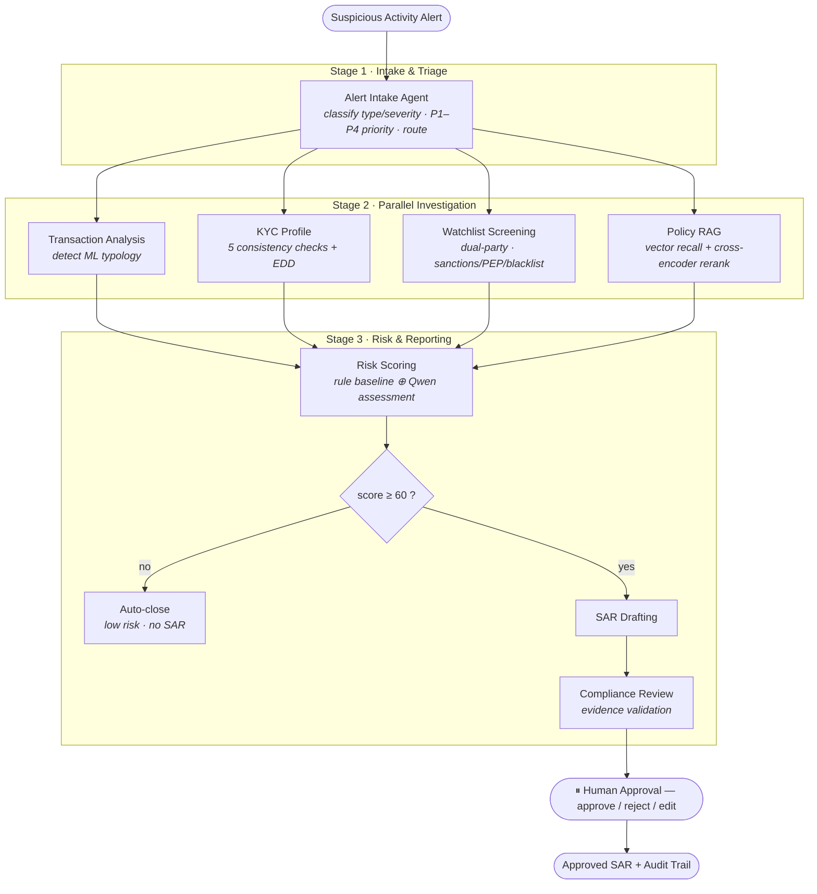

# CompliGuard AI

**A multi-agent AML compliance investigation system.** It turns a raw suspicious-activity alert into a fully investigated, explainable case — with a drafted Suspicious Activity Report (SAR) — in about a minute, while keeping a human analyst in control of the final decision.

Built with **LangGraph** orchestration, a **local Qwen** LLM (via Ollama), **RAG with cross-encoder reranking** (ChromaDB), tool-calling into **Supabase**, and a **FastAPI** backend. Runs entirely on a local model — no per-token API bills, and customer data never leaves the environment.

---

## The problem

Bank compliance teams receive hundreds of suspicious-activity alerts daily. Each one requires an analyst to manually pull transaction history, cross-reference the customer's KYC profile, screen watchlists, look up internal policy, judge the risk, and write a SAR. It's slow, repetitive, and inconsistent between analysts.

**CompliGuard AI automates the investigation** and hands the analyst a finished, evidence-backed draft to approve — it never files anything automatically.

---

## Architecture

A LangGraph pipeline organised into three stages. Stage 2's four investigation
agents run **in parallel**; results fan into risk scoring; low-risk cases exit
early before the expensive drafting step.



## Agent pipeline

| # | Agent | Stage | Responsibility |
|---|-------|-------|----------------|
| 1 | **Alert Intake** | Intake & Triage | Classifies the alert type and severity, assigns a **P1–P4** case priority, extracts the key entities, and decides which investigations to trigger |
| 2 | **Transaction Analysis** | Investigation | Aggregates transaction facts and detects the ML **typology** — structuring, money mule, layering/dispersion, high-risk overseas, or volume spike |
| 3 | **KYC Profile** | Investigation | Runs **5 consistency checks** (income, occupation, account age, risk category, prior alerts) and triggers **Enhanced Due Diligence** |
| 4 | **Watchlist Screening** | Investigation | Fuzzy-screens **both customer and recipient** against sanctions / PEP / internal blacklist; returns all matches and an aggregate verdict |
| 5 | **Policy RAG** | Investigation | Retrieves the most relevant internal AML policies via **vector recall + cross-encoder reranking** |
| 6 | **Risk Scoring** | Risk & Reporting | Blends a transparent **rule-based baseline** with an independent **Qwen assessment** into a final score, level, and recommendation |
| 7 | **SAR Drafting** | Risk & Reporting | Generates a structured **Suspicious Activity Report** draft grounded in the findings and cited policy |
| 8 | **Compliance Review** | Risk & Reporting | Validates that **every claim is evidence-backed**; scores completeness and quality |
| 9 | **Human Approval** | HITL | Pauses the pipeline for the analyst to **approve, reject, or edit** before anything is filed |

> Every agent extends `BaseAgent` and emits a chain-of-thought reasoning trace, a **confidence score**, and an agent-to-agent (A2A) status message — producing a full **audit timeline** and per-agent confidence for every case.

### Design principles

- **Hybrid, not pure-LLM** — deterministic rules compute facts and provide an auditable safety floor; the LLM reasons, judges, and explains. Auditable *and* intelligent.
- **Cost-aware** — the cheapest LLM call is the one never made. Tool calls, math, and name matching are plain Python; the LLM is used only where reasoning adds value.
- **Explainable** — every agent emits a reasoning trace + confidence; a full audit timeline and per-agent confidence are produced for every case.
- **Human-in-the-loop** — the system prepares evidence and a draft; a human makes the final call.

---

## Tech stack

| Layer | Technology |
|-------|-----------|
| Orchestration | LangGraph |
| LLM | Qwen 2.5 (local, via Ollama) — OpenAI-compatible API |
| Embeddings | nomic-embed-text (Ollama) |
| Vector DB / RAG | ChromaDB + `ms-marco-MiniLM` cross-encoder reranker |
| Relational DB | Supabase (Postgres) |
| Watchlist matching | rapidfuzz |
| API | FastAPI + Uvicorn |

---

## Repository structure

```
backend/
├── main.py                 # CLI runner
├── server.py               # FastAPI server entry point
├── schema.sql              # Supabase tables + seed data
├── requirements.txt
└── app/
    ├── orchestrator.py     # wires the agents into the LangGraph
    ├── api/routes.py       # FastAPI endpoints
    ├── core/
    │   ├── config.py       # loads .env, all settings
    │   └── state.py        # the shared CaseState
    ├── agents/             # one file per agent + base.py (BaseAgent)
    ├── services/llm.py     # Qwen chat + embeddings
    ├── tools/
    │   ├── db.py           # Supabase queries
    │   └── rag.py          # ChromaDB + reranking
    └── data/scenarios.py   # demo alerts
```

---

## Setup

### Prerequisites
- **Python 3.11+**
- **Ollama** ([ollama.com](https://ollama.com)) — runs the local LLM
- A **Supabase** project (free tier) — the relational database

### 1. Clone + create a virtual environment
```bash
git clone https://github.com/sonnysanputra/ComplianceGuard.git
cd ComplianceGuard
python -m venv venv
# Windows:
.\venv\Scripts\Activate.ps1
# macOS/Linux:
source venv/bin/activate
```

### 2. Install dependencies
```bash
cd backend
pip install -r requirements.txt
```

### 3. Pull the local models (Ollama)
```bash
ollama pull qwen2.5:7b
ollama pull nomic-embed-text
```
> Lower-spec machine? Use `qwen2.5:3b` and set `CHAT_MODEL=qwen2.5:3b` in `.env`.

### 4. Set up Supabase
1. Create a project at [supabase.com](https://supabase.com).
2. In the **SQL Editor**, paste and run [`backend/schema.sql`](backend/schema.sql) — this creates and seeds the `customers`, `transactions`, and `watchlist` tables.
3. From **Settings → API**, copy the **Project URL** and the **Secret** key.

### 5. Configure environment
Create `backend/.env` (copy from `backend/.env.example`):
```
OLLAMA_BASE_URL=http://localhost:11434/v1
CHAT_MODEL=qwen2.5:7b
EMBED_MODEL=nomic-embed-text
SUPABASE_URL=https://YOUR-PROJECT.supabase.co
SUPABASE_KEY=sb_secret_...
```
> `.env` is gitignored — never commit it.

---

## Running

Make sure Ollama is running and your venv is active. From `backend/`:

### CLI (interactive)
```bash
python main.py
```
Pick one of the 4 demo cases; it runs the full investigation, shows findings + SAR draft, and pauses for your approval.

### API server
```bash
python server.py
```
Then open **http://localhost:8000/docs** for an interactive UI to test every endpoint.

| Method | Endpoint | Purpose |
|--------|----------|---------|
| GET | `/scenarios` | list the demo alerts |
| POST | `/investigate` | run a case (returns findings; pauses at HITL) |
| GET | `/case/{id}` | fetch a case's current state |
| POST | `/case/{id}/decision` | approve / reject / edit (resumes the case) |

---

## Demo scenarios

| Case | Typology | Outcome |
|------|----------|---------|
| AML-2026-001 | Structuring (sub-threshold, overseas) | High → SAR |
| AML-2026-002 | Money mule (large in → forwarded out) | Critical → SAR + EDD |
| AML-2026-003 | Layering / dispersion | Elevated → SAR |
| AML-2026-004 | False positive (known supplier) | Low → auto-closed, no SAR |

---

## Notes

- First run downloads the cross-encoder reranker (~80MB) and rebuilds the ChromaDB policy store automatically.
- The vector store (`backend/chroma_db/`) and `venv/` are generated artifacts — gitignored and rebuilt on demand.
- On a CPU-only machine, SAR drafting on the 7B model takes ~1 minute; the smaller model is faster.
