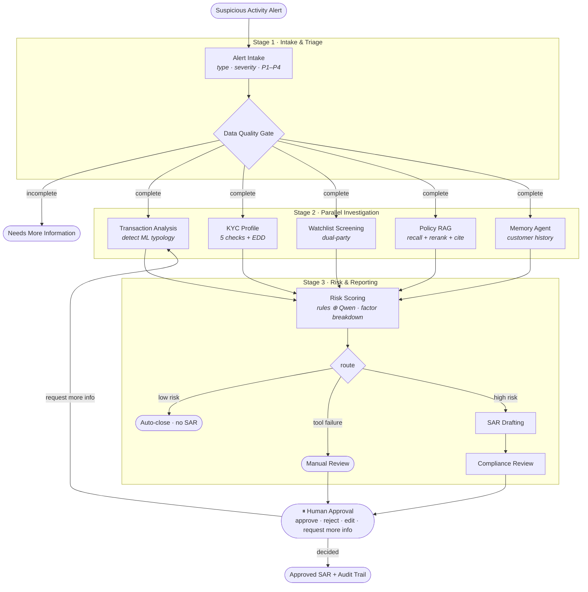

# CompliGuard AI

**A multi-agent AML compliance investigation system.** It turns a raw suspicious-activity alert into a fully investigated, explainable case — with a drafted Suspicious Activity Report (SAR) — in about a minute, while keeping a human analyst in control of the final decision.

Built with **LangGraph** orchestration, a **local Qwen** LLM (via Ollama), **RAG with cross-encoder reranking** (ChromaDB), tool-calling into **Supabase**, long- and short-term **memory**, and a **FastAPI** backend with live streaming. Runs entirely on a local model — no per-token API bills, and customer data never leaves the environment.

---

## The problem

Bank compliance teams receive hundreds of suspicious-activity alerts daily. Each one requires an analyst to manually pull transaction history, cross-reference the customer's KYC profile, screen watchlists, look up internal policy, judge the risk, and write a SAR. It's slow, repetitive, and inconsistent between analysts.

**CompliGuard AI automates the investigation** and hands the analyst a finished, evidence-backed draft to approve — it never files anything automatically.

---

## Architecture

A LangGraph pipeline. A data-quality gate halts incomplete cases up front; five
investigation agents then run **in parallel**, fan into risk scoring, and the case
either auto-closes (low risk), escalates to manual review (a tool failed), or
drafts a SAR for human approval.



## Agent pipeline

| # | Agent | Stage | Responsibility |
|---|-------|-------|----------------|
| 1 | **Alert Intake** | Intake & Triage | Classifies alert type/severity, assigns a **P1–P4** priority, extracts entities, routes |
| 2 | **Data Quality Gate** | Intake & Triage | Checks essential data is present; halts incomplete cases with **NEEDS_MORE_INFORMATION** instead of investigating blind |
| 3 | **Transaction Analysis** | Investigation | Detects the ML **typology** — structuring, money mule, layering/dispersion, high-risk overseas, volume spike |
| 4 | **KYC Profile** | Investigation | **5 consistency checks** (income, occupation, account age, risk, history) + triggers **EDD** |
| 5 | **Watchlist Screening** | Investigation | Fuzzy-screens **both customer and recipient** against sanctions / PEP / blacklist |
| 6 | **Policy RAG** | Investigation | Retrieves relevant policies via **vector recall + cross-encoder rerank**, returns scored **citations** |
| 7 | **Memory Agent** | Investigation | **Long-term memory** — prior cases, prior escalations, repeat recipients, analyst overrides |
| 8 | **Risk Scoring** | Risk & Reporting | Blends a **rule baseline** with an independent **Qwen assessment**; emits a **factor breakdown** with evidence; forces manual review on tool failure |
| 9 | **SAR Drafting** | Risk & Reporting | Generates a structured **SAR** with policy references |
| 10 | **Compliance Review** | Risk & Reporting | Validates **every claim is evidence-backed**; scores completeness + quality |
| 11 | **Human Approval** | HITL | Structured decision: **approve / reject / edit / request_more_info**, with SAR edits and risk-level overrides |

> Every agent extends `BaseAgent` and emits a chain-of-thought reasoning trace, a **confidence score**, and an agent-to-agent (A2A) status message — producing a full **audit timeline** and per-agent confidence for every case.

### Design principles

- **Hybrid, not pure-LLM** — deterministic rules compute facts and provide an auditable safety floor; the LLM reasons, judges, and explains.
- **Cost-aware** — tool calls, math, and name matching are plain Python; the LLM is used only where reasoning adds value (~3–6 calls per case, $0 on a local model).
- **Explainable & auditable** — reasoning + confidence per agent, a full audit timeline, an evidence-backed risk-factor breakdown, and cited policies for every decision.
- **Fail-safe** — incomplete data → request more info; a failed tool → manual review (never a SAR on bad data); a human always makes the final call.

---

## Key features

- **Multi-agent orchestration** (LangGraph) with parallel investigation and conditional routing
- **Real RAG** — embeddings + **cross-encoder reranking**, with scored **policy citations**
- **Policy documents as files** — drop your own `.md` / `.pdf` policies into `app/tools/policies/`; the system auto-re-indexes them
- **Short- + long-term memory** — graph state per case, plus customer history that **boosts repeat-offender risk**
- **Explainable risk scoring** — rule + AI blend with a **factor-by-factor breakdown + evidence**
- **Human-in-the-loop** — structured decisions, SAR edits, risk overrides, and a bounded **re-investigation loop**
- **Data-quality gate** and **error policy** (failed tool → manual review)
- **Persistent audit trail** — every case, event, agent output, risk assessment, SAR, and decision saved to Supabase (survives restarts)
- **SAR export** to **PDF / DOCX / Markdown**
- **Live progress streaming** (Server-Sent Events) so the UI shows each agent completing in real time
- **Offline test suite** (pytest) with golden typology tests

---

## Tech stack

| Layer | Technology |
|-------|-----------|
| Orchestration | LangGraph |
| LLM | Qwen 2.5 (local, via Ollama) — OpenAI-compatible API |
| Embeddings | nomic-embed-text (Ollama) |
| Vector DB / RAG | ChromaDB + `ms-marco-MiniLM` cross-encoder reranker |
| Relational DB / audit | Supabase (Postgres) |
| Watchlist matching | rapidfuzz |
| API | FastAPI + Uvicorn (REST + SSE streaming) |
| Document export | fpdf2 (PDF), python-docx (DOCX), PyMuPDF (policy PDF ingest) |
| Tests | pytest |

---

## Repository structure

```
backend/
├── main.py                 # CLI runner
├── server.py               # FastAPI server entry point
├── schema.sql              # Supabase source tables + seed data
├── schema_cases.sql        # Supabase audit/persistence tables
├── requirements.txt
├── pytest.ini
├── tests/                  # offline test suite (LLM + DB mocked)
└── app/
    ├── orchestrator.py     # wires the agents into the LangGraph
    ├── api/routes.py       # FastAPI endpoints (REST + SSE + export)
    ├── core/
    │   ├── config.py       # loads .env, all settings
    │   └── state.py        # the shared CaseState
    ├── agents/             # one file per agent + base.py (BaseAgent)
    ├── services/
    │   ├── llm.py          # Qwen chat + embeddings
    │   └── persistence.py  # Supabase audit-trail writes/reads
    ├── tools/
    │   ├── db.py           # Supabase queries
    │   ├── rag.py          # ChromaDB + reranking + citations
    │   └── policies/       # policy documents (.md / .pdf) indexed by RAG
    └── data/scenarios.py   # demo alerts
```

---

## Setup

### Prerequisites
- **Python 3.11+**
- **Ollama** ([ollama.com](https://ollama.com)) — runs the local LLM
- A **Supabase** project (free tier) — the relational database + audit store

### 1. Clone + create a virtual environment
```bash
git clone https://github.com/sonnysanputra/ComplianceGuard.git
cd ComplianceGuard
python -m venv venv
# Windows:  .\venv\Scripts\Activate.ps1
# macOS/Linux:  source venv/bin/activate
```

### 2. Install dependencies
```bash
cd backend
pip install -r requirements.txt
```

### 3. Pull the local models (Ollama)
```bash
ollama pull qwen2.5:7b
ollama pull nomic-embed-text
```
> Lower-spec machine? Use `qwen2.5:3b` and set `CHAT_MODEL=qwen2.5:3b` in `.env`.

### 4. Set up Supabase
1. Create a project at [supabase.com](https://supabase.com).
2. In the **SQL Editor**, run [`backend/schema.sql`](backend/schema.sql) (source data) **and** [`backend/schema_cases.sql`](backend/schema_cases.sql) (audit/persistence tables).
3. From **Settings → API**, copy the **Project URL** and the **Secret** key.

### 5. Configure environment
Create `backend/.env` (copy from `backend/.env.example`):
```
OLLAMA_BASE_URL=http://localhost:11434/v1
CHAT_MODEL=qwen2.5:7b
EMBED_MODEL=nomic-embed-text
SUPABASE_URL=https://YOUR-PROJECT.supabase.co
SUPABASE_KEY=sb_secret_...
```
> `.env` is gitignored — never commit it.

---

## Running

Make sure Ollama is running and your venv is active. From `backend/`:

### CLI (interactive)
```bash
python main.py
```
Pick a demo case; it runs the full investigation, prints findings + risk breakdown + SAR draft, and pauses for your decision.

### API server
```bash
python server.py
```
Open **http://localhost:8000/docs** for an interactive UI. Check **`GET /health/ready`** first — it confirms Ollama + Supabase are reachable.

| Method | Endpoint | Purpose |
|--------|----------|---------|
| GET | `/health` · `/health/ready` | liveness · dependency check |
| GET | `/scenarios` | list demo alerts |
| POST | `/investigate` | run a case (blocking; pauses at HITL) |
| POST | `/investigate/stream` | run a case, **streaming agent progress (SSE)** |
| GET | `/cases` | list all investigated cases |
| GET | `/case/{id}` | full case state |
| GET | `/case/{id}/status` | lightweight status poll |
| GET | `/case/{id}/audit` | audit timeline + events |
| GET | `/case/{id}/sar` | the SAR draft text |
| POST | `/case/{id}/decision` | approve / reject / edit / request_more_info |
| POST | `/case/{id}/rerun-agent/{name}` | re-run a single agent |
| POST | `/case/{id}/export-sar?format=pdf\|docx\|markdown` | download the SAR report |

### Tests
```bash
pytest
```
Runs fully offline (LLM + DB mocked) in a few seconds — including **golden typology tests** that verify structuring, money-mule, layering, and false-positive detection.

---

## Demo scenarios

| Case | Typology / situation | Outcome |
|------|----------------------|---------|
| AML-2026-001 | Structuring (sub-threshold, overseas) | High → SAR |
| AML-2026-002 | Money mule (large in → forwarded out) | Critical → SAR + EDD |
| AML-2026-003 | Layering / dispersion | Elevated → SAR |
| AML-2026-004 | False positive (known supplier) | Low → auto-closed, no SAR |
| AML-2026-005 | Repeat offender (run after 001) | **Long-term memory boosts risk** |
| AML-2026-006 | Unknown customer, no data | **NEEDS_MORE_INFORMATION** (gate halts it) |

---

## Notes

- First run downloads the cross-encoder reranker (~80MB) and builds the ChromaDB policy store from `app/tools/policies/` automatically; it re-indexes whenever a policy file changes.
- Generated artifacts (`backend/chroma_db/`, `venv/`) and secrets (`.env`) are gitignored and rebuilt/supplied on demand.
- On a CPU-only machine, a full case takes ~1–2 minutes on the 7B model; the 3B model is faster.
- Persistence and the audit trail are best-effort — if the Supabase audit tables aren't created, investigations still run (with a logged warning).
